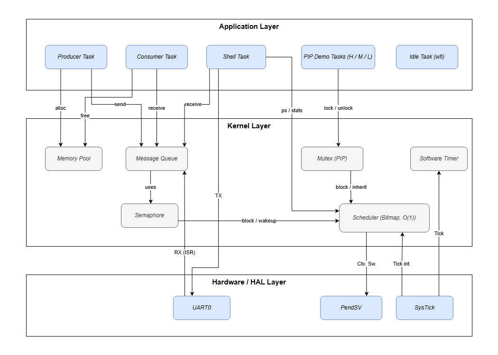

# cortex-m-rtos

A preemptive RTOS kernel built from scratch for ARM Cortex-M, running on QEMU.


I built this to put what I learned in OS and assembly courses into practice. The entire kernel is written from scratch on bare metal, covering everything from low-level context switching in ARM assembly to higher-level abstractions like synchronization primitives and memory management.

## Features

**Scheduling**
- O(1) preemptive, priority-based scheduler using bitmap + `CLZ` (same algorithm as FreeRTOS)
- Context switch handler written in ARM assembly (manual R4-R11 save/restore via PendSV)
- Round-robin among equal-priority tasks
- Software timers with periodic and one-shot modes

**Synchronization and IPC**
- Blocking mutex with wait queue and Priority Inheritance Protocol (PIP)
- Counting semaphore with ISR-safe `try_wait` and Direct Handoff wakeup
- Fixed-size message queue (dual-semaphore ring buffer) for inter-task and ISR-to-task communication
- O(1) fixed-block memory pool (embedded free-list, zero fragmentation)
- Zero-copy message passing (pointer transfer via message queue)

**Diagnostics**
- Interrupt-driven UART shell (UART0 ISR -> message queue -> shell task pipeline)
- Runtime inspection commands: `ps`, `stats`, `stack`, `uptime`, `free`
- Per-task CPU usage tracking (tick sampling) and stack high-water mark detection (`0xDEADBEEF` fill pattern)

## Architecture



### Data Flow Highlights

| Path | Description |
|------|-------------|
| **Zero-Copy IPC** | Producer -> `pool_alloc` -> write data -> `msg_queue_send(pointer)` -> Consumer -> read -> `pool_free` |
| **ISR-to-Task Pipeline** | UART0 HW IRQ -> `UART0_Handler` -> `msg_queue_send_isr` -> Shell RX Queue -> Shell Task wakes |
| **Priority Inheritance** | High blocks on Mutex -> Owner (Low) boosted to High's priority -> Medium cannot preempt -> Low finishes -> High runs |
| **O(1) Scheduling** | `ready_bitmap` -> `__builtin_ctz` -> `pop_from_ready_list` -> set `next_task` -> trigger PendSV |

## Demo: Priority Inheritance

Three tasks with different priorities share a Mutex. Without Priority Inheritance, Medium (priority 15) would preempt Low (priority 20) while Low holds the lock, starving High (priority 10) indefinitely. With PIP, Low temporarily inherits High's priority so it can finish and release the lock without being preempted.

QEMU output (`make run`):

```
[Low] Locking mutex
[Low] Mutex acquired, working
[High] Locking mutex
[Low] Unlocking mutex
[High] Mutex acquired, working
[High] Done
[Medium] Running (no mutex needed)
[Medium] Done
```

Medium only runs after both Low and High have finished, confirming that PIP prevented the inversion.

## Shell Demo

```
rtos> ps
ID      PRIO    STATE   SLEEP   CPU%
---------------------------------
0       5       BLOCK   0       0 %
1       5       READY   29      0 %
2       10      READY   419     1 %
3       15      READY   439     3 %
4       20      READY   409     4 %
5       25      RUNNING 0       0 %
6       31      READY   0       90 %
---------------------------------

rtos> stack
Task ID Used    Total
------------------------
0       22      256
1       22      256
2       22      256
3       22      256
4       22      256
5       31      256
6       16      256

rtos> stats
Context Switches: 1842

rtos> uptime
Current time: 5231 ticks
```

## Build & Run

Prerequisites: `arm-none-eabi-gcc`, `qemu-system-arm`, `make`

```bash
git clone https://github.com/alvin0603/cortex-m-rtos.git
cd cortex-m-rtos
make run
```

Exit QEMU: `Ctrl-A` then `X`

## Project Structure

```
cortex-m-rtos/
├── src/
│   ├── main.c              # Application entry, demo tasks, shell
│   ├── startup.s           # Vector table, Reset/PendSV handler (ARM assembly)
│   ├── hal/
│   │   ├── uart.c          # UART driver + UART0_Handler ISR
│   │   └── systick.c       # SysTick timer configuration
│   └── kernel/
│       ├── scheduler.c     # O(1) bitmap scheduler, SysTick_Handler, critical sections
│       ├── task.c          # TCB initialization, stack watermarking
│       ├── mutex.c         # Blocking Mutex with Priority Inheritance Protocol
│       ├── semaphore.c     # Counting Semaphore (blocking wait + ISR-safe try_wait)
│       ├── message_queue.c # Ring buffer message queue (dual-semaphore design)
│       ├── memory_pool.c   # O(1) fixed-block memory allocator (embedded free list)
│       └── software_timer.c# Callback-based periodic/one-shot timers
├── include/                # Header files (mirrors src/ structure)
├── linker.ld               # Memory layout (Flash + SRAM)
├── Makefile
└── .github/workflows/      # CI pipeline (build + QEMU smoke test)
```

## Technical Details

| Component | Implementation |
|-----------|---------------|
| **Target** | ARM Cortex-M3 (ARMv7-M), QEMU `lm3s6965evb` |
| **Toolchain** | `arm-none-eabi-gcc` (`-O2`, `-nostdlib`, `-ffreestanding`) |
| **Clock** | 12 MHz, SysTick at 120,000 reload = 10ms tick |
| **Scheduler** | Bitmap (`ready_bitmap`) + per-priority linked list, O(1) via `__builtin_ctz` |
| **Context Switch** | SysTick triggers scheduling -> PendSV (lowest priority) performs R4-R11 save/restore |
| **Stacks** | PSP per task (256 words each), MSP for kernel/ISR |
| **Memory** | Static allocation only. Memory Pool for dynamic-like usage without fragmentation |
| **Critical Sections** | `cpsid i` / `cpsie i` (global interrupt disable/enable) |
